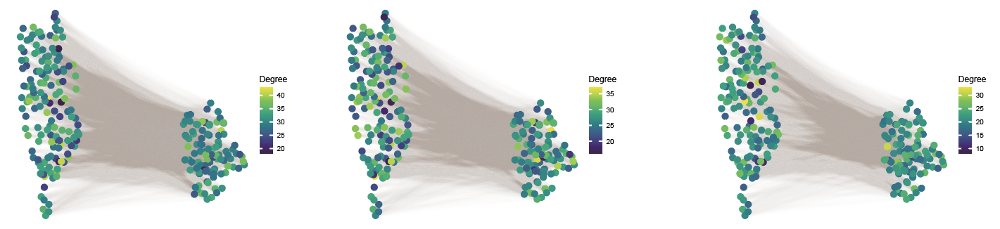
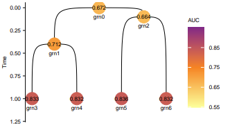

# Example of simulation data
***

In this tutorial, we demonstrate the basic usage of **LineageGRN** using synthetic simulated data. 

### Workflow Overview

1. **Input Data**:  
   We start by providing a time-scaled cell fate map and initializing a gene regulatory network (GRN) for the progenitor cell cluster at the root node.

2. **GRN Generation**:  
   By assigning state transition rates to each regulatory interaction, we generate GRNs for all downstream nodes of the fate map, which serve as the ground truth for subsequent analyses.

3. **Data Simulation**:  
   - Based on the GRNs of the leaf nodes (representing cell clusters of sampled cells), we simulate scATAC-seq data.  
   - We use the **SERGIO** algorithm to generate scRNA-seq data.  

4. **Validation**:  
   The simulated data enables us to evaluate the performance of **LineageGRN** in inferring and reconstructing dynamic GRNs across the time-scaled fate map.

This example highlights how LineageGRN integrates scATAC-seq and scRNA-seq data with lineage tracing to reconstruct dynamic gene regulatory networks.


```python
# Importing packages
import numpy as np
import pandas as pd
import os 
import re

from lineagegrn.plot.plot_analysis_results import *
from lineagegrn.downstream_analysis import *
from lineagegrn.utils.constants import *
from lineagegrn.utils.synthetic_data_generation import *
from lineagegrn.cell_lineage_reconstruction import *
from lineagegrn.gene_regulatory_network import*
from lineagegrn.utils.metrics import *
```

## Input Data
In this example, we directly take the topology structure of a time-scaled fate map ```fate_map_edge_dict``` with 7 nodes (cell clusters) as input. Besides, we need to set a state transition rate ```lambda``` to measure the probability of a child GRN inheriting the known regulatory relationship in its parent GRN.

```python
fate_map_path='examples/data/simulation/input/edge_dict_simulation.csv'
edge_dict=load_fate_map_topology(fate_map_path)
edge=parse_edge_dict(edge_dict)
fate_map=FateMap(edge)
newick_format=generate_newick(fate_map)
```
```
'((T3:0.6,T4:0.6)P1:0.4,(T5:0.9,T6:0.9)P2:0.1)P0:0;'
```
```R
# Rscript
Rscript plot_fate_map.R "((T3:0.6,T4:0.6)P1:0.4,(T5:0.9,T6:0.9)P2:0.1)P0:0;" 1.2 5 0.3 fate_map_plot.pdf
```


## GRN Generation

#### Generate the root node GRN ```grn0``` 

- Give the number of regulators (100) and target genes (150), and set the path to store the root node GRN
```python
output_path='examples/results/simulation/extra_output/ground_truth_grn'
```
- Run ```generate_root_grn``` and output a ```pandas.DataFrame``` named ```grn0```, whose rows represent regulators and columns represent target genes. Its elements ​​range from -1 to 1, absolute values ​​represent regulatory strength, and symbols represent activation (+) or repression (-).

``` python
grn0=generate_root_grn(150,100,output_path)
```

```plaintext
      0        1         2         3         4         5         6         7         8         9      ...       140       141       142       143       144       145       146       147       148       149
150  -0.7318   0.5520    0.0000    0.0000    0.0000    0.0000    0.0000    0.0000    0.0000   -0.7566   ...    0.0000   -0.6687   -0.1849    0.0000    0.0000    0.8071   -0.3010    0.0000    0.2533    0.0000
151   0.0000   0.3824    0.4575    0.4303    0.0000   -0.0109   -0.6965    0.0000    0.0000   -0.5088   ...    0.0000    0.0000    0.0000   -0.1950   -0.2014    0.0000   -0.0074    0.0000   -0.8496    0.0000
152  -0.6151  -0.7520    0.0000   -0.5634    0.0000   -0.0332    0.0000    0.0000    0.0000    0.0000   ...    0.0000    0.0000    0.0000   -0.0441   -0.1915    0.0000    0.1513   -0.0167    0.0000   -0.8906
153   0.0000   0.0000    0.0000    0.0000    0.7510    0.0000    0.0000    0.0000   -0.7391   -0.9003   ...    0.0000    0.0000    0.4218    0.6701    0.0000    0.0000    0.5298   -0.4038    0.0000    0.5000
154   0.5171  -0.5487   -0.5332    0.0000    0.0000    0.9371    0.7675    0.1911    0.6494    0.9113   ...    0.0271   -0.0509    0.0000    0.1592    0.6060    0.0000    0.0000    0.0000   -0.9362   -0.4575
...   ...      ...       ...       ...       ...       ...       ...       ...       ...       ...      ...      ...       ...       ...       ...       ...       ...       ...       ...       ...       ...
245  -0.6043  -0.1336    0.0000    0.0000    0.0000    0.0000    0.0000    0.0000    0.0590    0.0000   ...    0.0054   -0.1922    0.6736    0.0000    0.2150    0.0000    0.0000    0.0000    0.0000    0.0000
```

#### Generate the  descendant GRNs ```grn1```$\dotso$```grn6```
This step inputs the path of the dynamic reconfiguration of the gene regulatory network (same topological structure as fate map) and outputs a ```Dict```, whose length are the number of nodes (cell clusters) on the fate map. The keys of the ```Dict``` are ```node_id``` and each value is the corresponding grn, whose columns represent target genes and rows represent regulators. 

```python
grn_dict_path='examples/data/simulation/additional_input_data/grn_dict.csv'
grn_dict=load_fate_map_topology(grn_dict_path)
decendent_grns=generate_descendant_grns(7,150,100,grn_dict,output_path,grn0)
```

## Data Simulation
#### Generate scATAC-seq data
Run ```generate_atac_data``` and output a ```pandas.DataFrame``` named ```atac_data``` which must include four columns representing ```target_gene_id```, ```regulator_id```, ```co-accessibility score```, and ```node_id``` respectively.
```python
output_path='../data/simulation_data/test/input'
atac_data=generate_atac_data(decendent_grns,7,150,100,output_path)
```


#### Generate scRNA-seq data using SERGIO
- Generate two files required by SERGIO.
- Run ```generate_expression_data``` and output a dataframe for each node, whose columns represent sampled cells and rows represent regulator genes and target genes. The element ​​represent the gene expression value.

```python
sergio_files_path='examples/results/simulation/extra_output/sergio_files'
output_path='examples/results/simulation/extra_output/expression_files'
generate_expression_data(decendent_grns,7,150,100,300,sergio_files_path,output_path,1)
```
```plaintext
Start simulating new level
There are 100 genes to simulate in this layer
Done with current level
Start simulating new level
There are 150 genes to simulate in this layer
Done with current level
Start simulating new level
There are 100 genes to simulate in this layer
Done with current level
Start simulating new level
There are 150 genes to simulate in this layer
Done with current level
Start simulating new level
There are 100 genes to simulate in this layer
Done with current level
Start simulating new level
There are 150 genes to simulate in this layer
Done with current level
Start simulating new level
There are 100 genes to simulate in this layer
Done with current level
Start simulating new level
There are 150 genes to simulate in this layer
Done with current level
```

- Run ```convert_expression_file``` to convert gene expression data into LineageGRN input format. The final algorithm input is a dataframe which includes five columns: ```gene_id```, ```cell_id```, ```gene expression_value```, ```node_id```, ```gene_type``` (regulator or target gene).

```python
input_file='examples/results/simulation/extra_output/expression_files'
output_file='examples/data/simulation/input/expression_data.csv'

target_genes_name=pd.read_csv('examples/data/simulation/additional_input_data/target_genes_name.csv')['x'].tolist()
regulatory_genes_name=pd.read_csv('examples/data/simulation/additional_input_data/regulatory_genes_name.csv')['x'].tolist()
convert_expression_file(150,target_genes_name,regulatory_genes_name,input_file,output_file)
```

```plaintext
gene             cell       value   node_id   gene_type
0    target_0       cell_0    10.0    grn3      target_gene
1    target_0       cell_1    18.0    grn3      target_gene
2    target_0       cell_2    15.0    grn3      target_gene
3    target_0       cell_3    13.0    grn3      target_gene
4    target_0       cell_4    11.0    grn3      target_gene
...  ...            ...       ...     ...       ...
74995 regulator_99  cell_295   1.0    grn6      regulator_gene
74996 regulator_99  cell_296   1.0    grn6      regulator_gene
74997 regulator_99  cell_297   1.0    grn6      regulator_gene
74998 regulator_99  cell_298   4.0    grn6      regulator_gene
74999 regulator_99  cell_299   0.0    grn6      regulator_gene

300000 rows × 5 columns
```

## Data Simulation

#### Input synthetic gene expression and co-accessibility profiles
```python
atac_file_path = "examples/data/simulation/input/atac_data.csv"
expression_file_path = "examples/data/simulation/input/expression_data.csv"
```

#### Run the inference function 
This step outputs a dataframe for each target gene, whose number of rows is equal to ```nodes_number``` (7), and the number of columns is related to ```regulator_number```. The first column of this dataframe is ```target_gene_id```, the second column is ```node_id```, and the third to the last column indicates the regulatory strength and regulation mode (activation or repression) of the target gene by the corresponding regulator. 
```python
saved_dir='examples/results/simulation/inferred'
grns=FateMap(parse_edge_dict(grn_dict))
grn_inference = GRNInference(atac_file_path,expression_file_path,grns,saved_dir)
grn_inference.estimate_all_target_genes()
```


    -2024-09-24 11:32:58,551-INFO-52272 Start fitting target_gene_id:1
    -2024-09-24 11:34:56,762-INFO-25168 Finish inferencing leaves grn value for target_gene_id:1
    -2024-09-24 11:34:56,763-INFO-25168 Saved grn values for target_gene_id:1
    ... ...

We can also output the target gene network for each target gene in a ```Dict``` by running the method ```.get_target_networks```. In this method, we need to set a threshold (0.1) to screen for the effective regulatory relationships.
```python
target_networks_dict=grn_inference.get_target_networks(0.1)
```

```plaintext
{"grn3": {"0": {"lambda": 0.6116428512359448,"grn_value": [0.0, 0.0, 0.0, 0.0, 0.0, 0.0, -0.4425698207514982, 0.29298224636154474, 0.0, 0.0, 0.4353533375160287, 0.0, 0.5065959649468524, 0.3509382546110441, ..., 0.0, 0.35099408963364565, 0.0, -0.21043651910705435, 0.0]}}
```


The third optional gene regulatory network output format is a ```Dict```, where the key of the ```Dict``` is ```node_id```, and each value is a ```pandas.DataFrame``` with the number of rows being the number of target genes and the number of columns being the number of regulated genes.

```python
dynamic_networks_dict=get_dynamic_networks(saved_dir,grns,0.1,regulatory_genes_name,target_genes_name)
```

    {'grn0':             regulator_0  regulator_1  regulator_2  regulator_3  regulator_4  \
    target_0      -0.379122     0.711633     0.000000     0.000000     0.131632   
    target_1      -0.336749     0.193371     0.000000    -0.502988    -0.169468   
    target_2      -0.105994     0.000000    -0.180427     0.000000     0.562621   
    target_3       0.000000     0.000000     0.000000     0.000000     0.148689   
    target_4       0.000000     0.000000     0.258889     0.400358     0.000000   
    ...                 ...          ...          ...          ...          ...   
    target_145    -0.412486     0.000000    -0.246471     0.000000     0.462467   
    target_146     0.415713    -0.140728    -0.724423     0.195241     0.000000   
    target_147     0.000000    -0.140601     0.000000    -0.461557     0.384506   
    target_148     0.000000    -0.244510     0.000000    -0.155289     0.000000   
    target_149    -0.234581     0.198741    -0.189440     0.000000     0.000000   
    
                regulator_5  regulator_6  regulator_7  regulator_8  regulator_9  \
    target_0      -0.153831    -0.379208     0.000000     0.000000    -0.253205   
    target_1       0.000000     0.000000     0.145741     0.000000     0.000000   
    target_2       0.000000    -0.426593     0.287834     0.664276     0.000000   
    target_3       0.269684     0.295407     0.540570     0.219219     0.347215   
    target_4       0.476580    -0.234921    -0.274365     0.000000     0.000000   
    ...                 ...          ...          ...          ...          ...   
    target_145     0.586070     0.000000     0.000000     0.115736     0.565307   
    target_146     0.000000     0.118883     0.285013     0.219476    -0.100838   
    target_147     0.138593     0.000000    -0.411954    -0.144207    -0.209958   
    target_148     0.000000     0.000000    -0.143893     0.000000     0.294248   
    target_149     0.000000    -0.515080     0.000000     0.000000    -0.385077   
    ...
    target_147            -0.157546  0.000000  0.193603  
    target_148             0.716554  0.790531 -0.183264  
    [150 rows x 100 columns]}


##### Visualization
For a fate map, we can use the ```.get_path``` method to output the path of any specified leaf node and visualize the inferred gene regulatory network along the path.
```python
grns.get_path('grn5')
```
```
['grn0', 'grn2', 'grn5']
```
Take the gene regulatory network in the selected path from ```dynamic_network_dict``` and transform it in format. Use the ```get_gene_interaction``` function to output a three-column ```pandas.DataFrame```, where the first column is ```regulator_id```, the second column is ```target_gene_id```, and the third column is ```regulatory_strength```.

```python
network0,network2,network5=dynamic_networks_dict['grn0'],dynamic_networks_dict['grn2'],dynamic_networks_dict['grn5']
network0.columns=network2.columns=network5.columns=regulatory_genes_name
network0.index=network2.index=network5.index=target_genes_name

gene0_interaction, gene2_interaction, gene5_interaction = get_gene_interaction(network0),get_gene_interaction(network2),get_gene_interaction(network5)
gene0_interaction.to_csv('examples/results/simulation/extra_output/gene0_interaction.csv',header=None)
gene2_interaction.to_csv('examples/results/simulation/extra_output/gene2_interaction.csv',header=None)
gene5_interaction.to_csv('examples/results/simulation/extra_output/gene5_interaction.csv',header=None)
```
Visualize gene regulatory networks on selected pathways. The gene regulatory networks shown are ```grn0```, ```grn2``` and ```grn5```.
```R
# Rscript
Rscript plot_grn.R examples/results/simulation/extra_output/expression_files/Exp_grn5.csv examples/data/simulation/additional_input_data/target_genes_name.csv examples/data/simulation/additional_input_data/regulatory_genes_name.csv examples/results/simulation/extra_output/gene0_interaction.csv grn0_plot.pdf
Rscript plot_grn.R examples/results/simulation/extra_output/expression_files/Exp_grn5.csv examples/data/simulation/additional_input_data/target_genes_name.csv examples/data/simulation/additional_input_data/regulatory_genes_name.csv examples/results/simulation/extra_output/gene2_interaction.csv grn2_plot.pdf
Rscript plot_grn.R examples/results/simulation/extra_output/expression_files/Exp_grn5.csv examples/data/simulation/additional_input_data/target_genes_name.csv examples/data/simulation/additional_input_data/regulatory_genes_name.csv examples/results/simulation/extra_output/gene5_interaction.csv grn5_plot.pdf
```



## Validation
#### Calculate the AUROC and AUPRC value.
This step traverses all fate map nodes and outputs the AUROC and AUPRC obtained by comparing the inferred gene regulatory network with the real gene regulatory network.
```python
nodes=list(fate_map.nodes.keys())
auroc_list=[]
auprc_list=[]

for node_id in nodes:
    grn_infer=dynamic_networks_dict[node_id]
    grn_true=pd.read_csv('examples/data/simulation/extra_output/ground_truth_grn/'+node_id+'.csv')
    grn_true=grn_true.T
    auroc=compute_auroc(grn_infer,grn_true,0.1)
    auprc=compute_auprc(grn_infer,grn_true,0.1)
    print([node_id,auroc,auprc])
    auroc_list.append([node_id,auroc])
    auprc_list.append([node_id,auprc])
    
auroc_df=pd.DataFrame(auroc_list)
auroc_df.columns=['node_id','value']
auprc_df=pd.DataFrame(auprc_list)
auprc_df.columns=['node_id','value']
auprc_df.to_csv('examples/results/simulation/evaluation_result/auprc.csv',index=None)
auroc_df.to_csv('examples/results/simulation/evaluation_result/auroc.csv',index=None)
```

    ['grn0', 0.5994519770589117, 0.6717228828294495]
    ['grn1', 0.6709248585954783, 0.712408224107377]
    ['grn2', 0.6072614237064434, 0.6640750302853287]
    ['grn3', 0.8188240085184858, 0.8332435186071212]
    ['grn4', 0.8177177242199248, 0.8321948886133066]
    ['grn5', 0.8214236542051112, 0.8364298746683348]
    ['grn6', 0.8170608500573491, 0.8317090516001567]

##### Visualization
```R
# Rscript
Rscript plot_AUC.R "((grn3:0.6,grn4:0.6)grn1:0.4,(grn5:0.9,grn6:0.9)grn2:0.1)grn0:0;" examples/results/simulation/evaluation_result/auroc.csv AUROC_plot.pdf TRUE
Rscript plot_AUC.R "((grn3:0.6,grn4:0.6)grn1:0.4,(grn5:0.9,grn6:0.9)grn2:0.1)grn0:0;" examples/results/simulation/evaluation_result/auprc.csv AUPRC_plot.pdf TRUE
```

   


