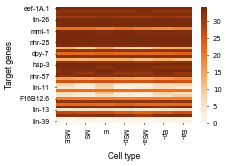
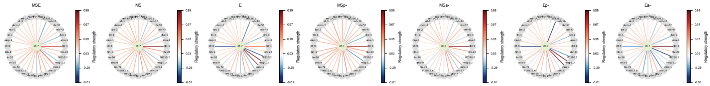
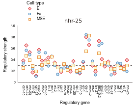
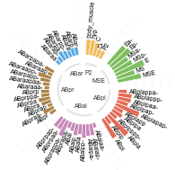
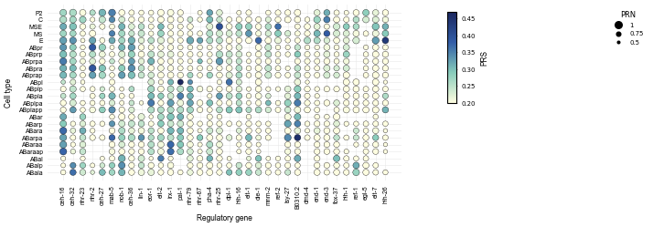
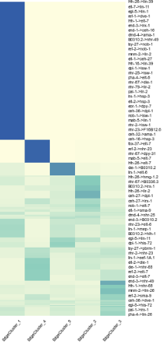

# Example of Caenorhabditis elegans dataset (Core)
***
In this tutorial, we utilized gene expression data and chromatin co-accessibility data, encompassing 34 regulatory genes and 41 target genes, along with the well-characterized C. elegans cell lineage, to infer gene regulatory networks and visualize their dynamic reconfiguration along the lineage.

This example demonstrates how to identify key regulatory genes driving cell differentiation and distinguish between specific and constitutive regulatory interactions at various developmental stages.

```python
import os
import pandas as pd
from lineagegrn.cell_lineage_reconstruction import *
from lineagegrn.gene_regulatory_network import *
from lineagegrn.plot.plot_analysis_results import *
from lineagegrn.downstream_analysis import *
```


## Data Preprocessing

This section provides an overview of the preprocessing steps applied to the datasets used in this study. The data includes **scRNA-seq data**, and **scATAC-seq data**, which were processed using standard methods widely adopted in the field. Below, we outline the preprocessing logic and describe the final input formats required for the pipeline.


### ATAC-seq Data Preprocessing

**Overall Workflow:**

1. **Input Data**: 
   -The raw data consists of three files that were processed using the `cicero` package.  
2. **Chromatin Co-accessibility**: 
    -After processing, two peaks (`peak1` and `peak2`) were identified as chromatin fragments, along with a co-accessibility score (`co-access`). Rows with `co-access` values less than 0.1 were removed.  
4. **Mapping Peaks to Genes**:  
   - `peak2` fragments were matched to gene IDs.  
   - The gene IDs were further matched to gene names, which were identified as **target genes**.  
5. **Motif Scanning on `peak1`**:  
   - Motif scanning was performed on `peak1` regions to identify the transcription factors (TFs) that bind to each peak.  
   - A single `peak1` may have multiple motif IDs, indicating that a chromatin fragment can bind multiple TFs. Consequently, one target gene may have multiple regulatory genes.  
6. **Final Matching**:  
   - `peak1` was matched to regulatory genes (TFs), and `peak2` was matched to target genes.  
   - The final dataset links:
     - A single `peak1` to **multiple regulatory genes** (TFs).  
     - A single `peak2` to **one target gene**.  
     - The co-accessibility (`co-access`) score represents the shared score between the target gene and its regulatory genes.


### scRNA-seq Data Preprocessing

**Overall Workflow:**
1. **Input Data**:
   -The input data for scRNA-seq analysis is typically organized as a gene × cell matrix
2. **Quality Control**:
   - Cells with low gene expression levels or signs of cell death were removed.  
3. **Highly Variable Genes (Optional)**:
   - Highly variable genes were selected for further analysis to focus on biologically significant variation.  
4. **Normalization**:
   - Gene expression levels were normalized such that the average expression of genes in each cell was standardized to 0, and the variance was standardized to 1.


### Final Input Formats

The final inputs for gene regulatory network inference are as follows:

#### scATAC-seq Data:
- **Columns**:
  - `Regulatory Gene`: The name of the regulatory gene associated with `peak1`, derived from motif scanning.  
  - `Target Gene`: The name of the target gene associated with `peak2`, based on genomic position annotation. 
  - `Co-access Score`: The co-accessibility score calculated by the `cicero` package, representing the prior regulatory relationship strength.   
  - `Cell Cluster ID/Cell Type`: The cluster ID or cell type to which the cell belongs, providing additional context about the regulatory relationship.  

- **Example**:

| Regulatory Gene (TF) | Target Gene | Co-access Score | Cell Cluster ID/Type |
| -------------------- | ----------- | --------------- | -------------------- |
| GENE_A               | GENE_D      | 0.45            | Cluster_1            |
| GENE_B               | GENE_D      | 0.32            | Cluster_2            |
| GENE_C               | GENE_E      | 0.28            | Cluster_3            |


#### scRNA-seq Data:
- **Columns**:
  - `Gene Name`: Name of the gene (e.g., GENE_A).  
  - `Cell Name`: Unique identifier for each cell.  
  - `Gene Expression`: Normalized gene expression value.  
  - `Cell Cluster ID/Cell Type`: The cluster or cell type label for the cell.  
  - `Gene Type`: Either `Regulatory Gene` or `Target Gene`.  

- **Example**:

| Gene Name | Cell Name | Gene Expression | Cell Cluster ID/Type | Gene Type       |
| --------- | --------- | --------------- | -------------------- | --------------- |
| GENE_D    | Cell_1    | 1.23            | Cluster_1            | Target Gene     |
| GENE_A    | Cell_2    | 2.45            | Cluster_2            | Regulatory Gene |


### References and Tools Used

- **ATAC-seq Data Preprocessing**:
  - [Cicero R package](https://cole-trapnell-lab.github.io/cicero-release/) for chromatin co-accessibility analysis.  
  - Motif scanning performed using [motifmatchr](https://bioconductor.org/packages/motifmatchr).  

- **scRNA-seq Data Preprocessing**:
  - Quality control, normalization, and highly variable gene selection performed using [Scanpy](https://scanpy.readthedocs.io/) or [Seurat](https://satijalab.org/seurat/).  

---


## Time-scaled cell fate map retrieval
In this example, we directly use the well-established cell lineage tree of *Caenorhabditis elegans*. Six subtrees of the lineage are used as cell fate maps.

Taking the MSE-lineage as an example, we input the topological structure of a cell fate map using the ```Dict``` data type. The cell fate map can then be generated by instantiating an object of the ```FateMap``` class.

```python
fate_map_path='examples/data/C.elegans/C.elegans_Core/input_data/MSE/edge_dict_MSE.csv'
edge_dict=load_fate_map_topology(fate_map_path)
edge=parse_edge_dict(edge_dict)
fate_map=FateMap(edge)
```


---

## Gene regulatory network inference

#### Input single-cell gene expression and co-accessibility profiles
```python
atac_file_path = "examples/data/C.elegans/C.elegans_Core/input_data/MSE/atac_data.csv"
expression_file_path = "examples/data/C.elegans/C.elegans_Core/input_data/MSE/expression_data.csv"

```

#### Run the gene regulatory network inference function
This step generates a dataframe for each target gene. The dataframe contains a number of rows equal to the number of cell clusters and columns corresponding to the number of regulatory genes. 

- The **first column** represents the name of the target gene.
- The **second column** corresponds to the cell cluster id, indicating the specific node in the regulatory network.  
- The **third to the last columns** capture the regulatory relationship between the target gene and its regulators, including:
  - The **regulatory strength**, which quantifies the effect of each regulator on the target gene.  
  - The **regulation mode**, specifying whether the regulation is **activation** or **repression**.  

```python
saved_dir = 'examples/results/C.elegans/C.elegans_Core/MSE'
regulator_names = list(pd.read_csv('examples/data/C.elegans/C.elegans_Core/additional_input_data/regulatory_genes_name.csv',index_col=0).iloc[:,0])
target_gene_names = list(pd.read_csv('examples/data/C.elegans/C.elegans_Core/additional_input_data/target_genes_name.csv',index_col=0).iloc[:,0])

grn_inference = GRNInference(atac_file_path, expression_file_path,fate_map, saved_dir)
grn_inference.estimate_all_target_genes()
```

```plaintext
2024-09-24 11:32:58,551 - INFO - 52272 Start fitting target_gene_id:eef-1A.1
2024-09-24 11:34:56,762 - INFO - 25168 Finish inferencing leaves grn value for target_gene_id:eef-1A.1
2024-09-24 11:34:56,763 - INFO - 25168 Saved grn values for target_gene_id:eef-1A.1
...
```

This step generates the target gene network for each target gene and stores it in a ```Dict``` using the method ```.get_target_networks```. 

In this method, a regulatory strength threshold (default: 0.1) is applied to filter out ineffective regulatory interactions. Only interactions exceeding this threshold are included in the resulting network, ensuring the biological relevance and computational robustness of the analysis.

```python
target_networks_dict=grn_inference.get_target_networks(0.1)
```

---

## Downstream analysis

### Revealing how inferred GRNs reconfigure along cell lineages
```python
regulator_dict=get_regulators('nhr-25', 'Ea-', saved_dir, regulator_names)
```
```plaintext
{'ceh-16': 0.3416499361653389, 'ceh-32': 0.5666916385389806, 'nhr-23': -0.4925718598273363, 'nhr-2': 0.24816905174646298, 'ceh-27': 0.1109726233953044, 'mab-5': -0.5323998868840484, 'nob-1': 0.23886076979862184, 'ceh-36': 0.5233501635329588, 'lin-1': 0.2897392528846144, 'eor-1': -0.4594620129243684, 'elt-2': 0.2976629236568841, 'irx-1': -0.13928695618132647, 'pal-1': 0.2489742931460235, 'nhr-79': -0.254491892554381, 'nhr-67': -0.27121213967865765, 'pha-4': 0.27487150765088963, 'nhr-25': 0.30274213501027825, 'dpl-1': 0.18021229240405684, 'hlh-16': 0.16969014424893344, 'elt-1': 0.36983762199901216, 'die-1': -0.8442123287166449, 'mnm-2': 0.7498769338962882, 'ref-2': 0.3727797808889699, 'lsy-27': -0.1369907430615935, 'B0310.2': -0.6490667615035224, 'dmd-4': -0.6883133898208357, 'end-1': 0.33351354696441643, 'end-3': -0.3033015231479436, 'tbx-37': 0.13312002995799968, 'hlh-1': 0.20481617473191782, 'ref-1': 0.3388880575957087, 'egl-5': -0.32889328111019744, 'elt-7': 0.2227128886808342, 'hlh-26': 0.19039319833013132}
```

```python
target_dict=get_target_genes('elt-7', 'Ea-', saved_dir, regulator_names)
```
```plaintext
{'ama-1': 0.12514667502715765, 'B0310.2': -0.5690056949430876, 'B0336.3': -0.20087389262169697, 'ceh-16': 0.20728454926555562, 'ceh-27': -0.37076693848880266, 'ceh-43': 0.14481679327711647, 'die-1': 0.3327874528028564, 'dpl-1': 0.9878740137951658, 'dpy-31': 0.12992381853423898, 'dpy-7': 0.32438275516616405, 'dve-1': -0.28369422531295474, 'eef-1A.1': 0.13208107870118843, 'elt-1': 0.1485771897337543, 'elt-6': -0.3187646539838563, 'elt-7': -0.1953150517426333, 'F16B12.6': 0.13044802075213238, 'his-72': -0.1813583591231202, 'hlh-1': 0.2157784109364843, 'hmg-1.2': -0.13887148392408816, 'hmg-11': 0.09813520413087781, 'hsp-3': 0.24737695149461586, 'irx-1': -0.2025020427447795, 'isw-1': 0.05843540247802143, 'lin-1': 0.3000627454486636, 'lin-11': -0.034702965083833526, 'lin-13': 0.07181059724759799, 'lin-26': 0.14910339699633657, 'lin-39': 0.047706651933201984, 'lir-2': -0.006536041410562453, 'mab-5': -0.05103641530899973, 'mep-1': 0.2284986996612302, 'mml-1': -0.13379086742843393, 'nhr-23': 0.2373577819074984, 'nhr-25': 0.2227128886808342, 'nhr-49': 0.0037408606991700503, 'nhr-57': 0.13837017790147818, 'nhr-68': -0.3052208724250098, 'nob-1': 0.10537876339917188, 'pbrm-1': 0.22186185639658834, 'sma-9': 0.1577509253281303, 'tps-2': 0.17392960836027058}
```

#### Visualization

1. Visualization of the change in the total number of regulatory interactions in the gene regulatory network along the fate map.

```python
output_path='examples/results/C.elegans/C.elegans_Core/figures/'
path=list(fate_map.nodes.keys())
plot_dynamic_edges_number(dynamic_networks_dict,path,output_path)
```


2. Visualization of the change in the number of target genes regulated by the regulatory gene 'elt-7' along the fate map.
```python
plot_dynamic_regulator_number(saved_dir, regulator_names,'elt-7', path, threshold=0.05,output_path)
```


3. Visualization of the change in the number of regulatory genes which regulate the expression of target gene 'elt-7' along the fate map.
```python
plot_dynamic_target_gene(saved_dir, regulator_names, 'elt-7', path, 0.05,output_path)
```


4. Visualization of the changes in the number of negative regulation of each target gene along the fate map.
```python
plot_dynamic_regulator_number_heatmap(target_gene_names, regulator_names,'negative',saved_dir, path,0.1, output_path)
```


5. Visualization of the changes in the number of positive regulation of each target gene along the fate map.
```python
plot_dynamic_regulator_number_heatmap(target_gene_names, regulator_names,'positive',saved_dir, path,0.1, output_path)
```


6. Visualization of the changes in the total number of regulation of each target gene along the fate map.
```python
plot_dynamic_regulator_number_heatmap(target_gene_names, regulator_names,'total',saved_dir, path,0.1, output_path)
```


7. Visualization of the dynamic regulatory networks of the regulatory gene 'elt-7' along the fate map.
```python
plot_dynamic_regulatory_network('elt-7',dynamic_networks_dict,path,output_path,0.1,figsize=(16,2))
```


8. Visualization of the changes in the regulatory strength of each regulatory gene on the fate map path (with 'Ea-' as the leaf node) on the target gene 'nhr-25'.
```python
path=fate_map.get_path("Ea-")
plot_dynamic_regulatory_strength(saved_dir,path,regulator_names,'nhr-25',output_path)
```


9. Visualization of the comparison results of the activity of the regulatory gene 'nhr-25' at different nodes of different fate maps.
```python
map_df = pd.read_csv('examples/data/C.elegans/C.elegans_Core/additional_input_data/fate_map_topology.csv')
edges_dict_Celegans = {}
    
for top_key, group in map_df .groupby("Lineage"):
    sub_dict = {f"{row['Parent']}->{row['Child']}": row['Length'] for _, row in group.iterrows()}
    edges_dict_Celegans[top_key] = sub_dict

input_path=os.path.dirname(saved_dir)
plot_dynamic_regulator_activity(edges_dict_Celegans,input_path,'nhr-25',regulator_names,0.35,output_path)
```



### Identifying key regulatory genes driving cell differentiation
This step outputs the results of the inferred key regulatory genes that determine the differentiation direction of downstream cells at each progenitor cell cluster (node). It is a ```pandas.DataFrame``` containing 8 columns: ```regulator_id```, ```positive_regulatory_strength```, ```positive_regulation_number```, ```negative_regulation_number```, ```PRS```,	```PRN```, and	```node_id```.


```python
key_regulators_df_concat=pd.DataFrame()
for lineage in edges_dict_Celegans.keys():
    edges = parse_edge_dict(edges_dict_Celegans[lineage])
    fatemap = FateMap(edges,high_expression_genes[lineage])
    nodes=fatemap.node_internals[::-1]+[fatemap.node_root]
    for node in nodes:
        input_path=os.path.join(os.path.dirname(saved_dir),lineage)
        key_regulators=find_diff_genes(input_path,fatemap,0.05,regulator_names,target_gene_names,node)
        high_expression_genes_of_ancestor_node=list(set(key_regulators.loc[((key_regulators['PRS']>0.2) & (key_regulators['PRN']>0.7)),'regulator_id']) & set(target_gene_names))
        high_expression_genes[lineage][node]=high_expression_genes_of_ancestor_node
        fatemap = FateMap(edges,high_expression_genes[lineage])
        key_regulators_df_concat=pd.concat([key_regulators_df_concat,key_regulators])
```

```plaintext
regulator_id	positive_regulatory_strength	positive_regulation_number	negative_regulation_number	PRS	PRN	node_id							
    ceh-16	3.571054	9.0	0.0	0.396784	1.0	E
    ceh-36	3.414377	9.0	0.0	0.379375	1.0	E
    nhr-2	3.340567	8.0	0.0	0.417571	1.0	E
    elt-7	3.424669	7.0	0.0	0.489238	1.0	E
    nhr-79	2.417552	6.0	0.0	0.402925	1.0	E
    ...	...	...	...	...	...	...
    nhr-67	0.034049	4.0	4.0	0.008512	0.5	P2

```

#### Visualization
```python
nodes=list(key_regulators_df_concat['node_id'].drop_duplicates())
plot_diff_genes(key_regulators_df_concat,nodes,regulator_names,output_path,figsize=(5,2.5))
```



### Identifying specific and constitutive regulatory interactions.  
This step outputs the clustering results of each regulatory relationship using fuzzy C-means clustering method. X is a ```pd.DataFrame```, where each row represents a regulatory relationship, each column represents a node in the fate map, and each element is 0 (the regulatory relationship dose not exist in the node) or 1 (the regulatory relationship exists in the node); ```centers``` are the centers of the edge clusters; ```weight_matrix``` is the membership function of each regulatory relationship in each edge cluster.

```python
X,centers,weight_matrix=run_fuzzy_C_means_clustering(saved_dir,fate_map, 0.3, regulator_names, target_gene_names, len(regulator_names),len(target_gene_names), 5, 2)
```

```plaintext
    (      MSE  MS  E  MSp-  MSa-  Ep-  Ea-
    0       1   1  1     1     1    1    1
    1       1   1  1     1     1    1    1
    2       1   1  1     1     1    1    1
    3       1   1  1     1     1    1    1
    4       1   1  1     1     1    1    0
    ...   ...  .. ..   ...   ...  ...  ...
    1389    1   1  1     1     1    1    1
    1390    0   0  0     0     0    0    0
    1391    0   0  0     0     0    0    0
    1392    0   0  0     0     0    0    0
    1393    1   1  1     1     1    1    1
    
    [1394 rows x 7 columns],

            0         1         2         3         4         5         6
    0  0.046258  0.032178  0.117197  0.039124  0.050451  0.043458  0.947314
    1  0.188813  0.045104  0.963920  0.054591  0.113503  0.880305  0.834711
    2  0.990004  0.983410  0.980623  0.963207  0.947537  0.936966  0.961219
    3  0.933149  0.971438  0.075477  0.961343  0.821624  0.095924  0.134773
    4  0.007278  0.008996  0.011875  0.014350  0.015490  0.014834  0.008857,
                    
                    
                        EdgeCluster_1  EdgeCluster_2  EdgeCluster_3  EdgeCluster_4  \
    ceh-16->eef-1A.1       0.001904       0.003105       0.989338       0.004157   
    ceh-16->nhr-23         0.001904       0.003105       0.989338       0.004157   
    ceh-16->elt-1          0.001904       0.003105       0.989338       0.004157   
    ceh-16->hlh-1          0.001904       0.003105       0.989338       0.004157   
    ...
    hlh-26->dpl-1          0.998029  
    hlh-26->mab-5          0.998029  
    hlh-26->lin-39         0.001495  
    
    [1394 rows x 5 columns])
```

```python
edges_cluster_to_nodes=map_edge_clusters_to_nodes(saved_dir, fate_map,0.1, regulator_names,target_gene_names,5,0.3,X,len(regulator_names),len(target_gene_names),weight_matrix)
```

```plaintext
EdgeCluster_1	  EdgeCluster_2	  EdgeCluster_3	  EdgeCluster_4	  EdgeCluster_5
    MSE	0.000000	0.208333	1.000000	0.949686	0.000000
    MS	0.000000	0.000000	1.000000	1.000000	0.000000
    E	0.000000	1.000000	1.000000	0.000000	0.000000
    MSp-	0.008929	0.023810	0.936877	0.981132	0.029046
    MSa-	0.071429	0.148810	0.906977	0.792453	0.053942
    Ep-	0.000000	1.000000	0.860465	0.113208	0.000000
    Ea-	1.000000	0.744048	0.930233	0.163522	0.000000
```

#### Visualization
```python
plot_edge_cluster_weight(weight_matrix,output_path)
```


```python
plot_edge_cluster_to_nodes(edges_cluster_to_nodes, output_path)
```


