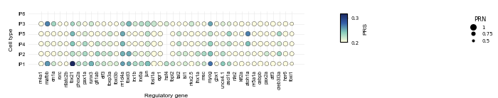

# Example of Zebrafish

***
In this tutorial, we utilized single-cell lineage tracing, gene expression and chromatin co-accessibility data of 139 regulatory genes and 34 target genes of zebrafish to infer the dynamic gene regulatory networks along zebrafish heart regeneration process and visualize their dynamic reconfiguration along the lineage.

This example demonstrates how to identify key regulatory genes driving cell differentiation and cell fate bias. Inaddition, we identify the specific and constitutive regulatory interactions at various developmental stages.

```python
import os
import pandas as pd

from lineagegrn.utils.metrics import *
from lineagegrn.cell_lineage_reconstruction import *
from lineagegrn.gene_regulatory_network import *
from lineagegrn.plot.plot_analysis_results import *
from lineagegrn.downstream_analysis import *
```


## Data Preprocessing

### 1. Input Data
- The input data is a CSV file containing cell barcodes and sequences.
- The sequences are converted to FASTA format for MUSCLE alignment.

**Example**
The CSV file contains columns for unique cell IDs and raw barcodes:

| cell_id | raw_barcodes |
| ------- | ------------ |
| Cell_1  | ATGCGTAC...  |
| Cell_2  | TTACGCTA...  |

### 2. Sequence Alignment
- Sequences are aligned using MUSCLE to identify similarities and mutations.

### 3. Data Parsing and Processing
- Aligned sequences are parsed and saved in CSV format.
- The data is sorted by sequence IDs and processed to generate a mutation matrix.

### 4. Mutation Matrix Generation
- The mutation matrix is created by comparing sequences in defined regions and identifying differences.

**Example**
The mutation matrix shows sequence differences across defined regions:

| Sequence ID | Region_1 | Region_2 | Region_3 | ... | Region_n |
| ----------- | -------- | -------- | -------- | --- | -------- |
| Cell_1      | 0        | 1        | 2        | ... | 0        |
| Cell_2      | 1        | 0        | 2        | ... | 3        |


### Example Output Files

| **Output File**                    | **Description**                           |
| ---------------------------------- | ----------------------------------------- |
| `output.fasta`                     | Converted FASTA file for MUSCLE alignment |
| `parse_aligned_sequences.csv`      | CSV file with parsed aligned sequences    |
| `sort_parse_aligned_sequences.csv` | Sorted aligned sequence file              |
| `mutation_matrix.csv`              | Generated mutation matrix file            |


## Time-scaled cell fate map reconstruction
```python
sc_mat=np.array(pd.read_csv('examples/data/zebrafish/input_data/barcode_site.csv',index_col=0))
cell_types=pd.read_csv("examples/data/zebrafish/input_data/cell_types.csv",index_col=0).to_dict()['celltypes']
t_S=15

edges,fate_map=get_fate_map(sc_mat, cell_types, t_S, beta=1, max_iter=1000, tol=1e-5,edge=True)
```


## Gene regulatory network inference
#### Input single-cell gene expression and co-accessibility profiles

```python
atac_file_path = "examples/data/zebrafish/input_data/atac_data.csv"
expression_file_path = "examples/data/zebrafish/input_data/expression_data.csv"
```
#### Run the gene regulatory network inference function

```python
saved_dir = 'examples/results/zebrafish'

regulator_names=list(pd.read_csv("examples/data/zebrafish/additional_input_data/regulatory_genes_name.csv")['x'])
target_gene_names=list(pd.read_csv("examples/data/zebrafish/additional_input_data/target_genes_name.csv")['x'])

grn_inference = GRNInference(atac_file_path, expression_file_path,fate_map, saved_dir)
grn_inference.estimate_all_target_genes(20)
target_networks_dict=grn_inference.get_target_networks(0)
```


## Downstream analysis 

### Revealing how inferred GRNs reconfigure along cell lineages

```python
regulator_dict=get_regulators('admb', 'Tcells', saved_dir, regulator_names)
```

```plaintext
{'nr4a1': 0.11825367777901924, 'mafbb': 0.4228665855088654, 'en1a': 0.6564480066299438, 'rorc': 0.0, 'nfatc2b': 0.6564480066299438, 'tbx21': -0.05690246596441495, 'phox2a': 0.6564480066299438, 'pax1a': 0.6564480066299438, 'runx3': 0.15006246468573334, 'gfi1ab': 0.6564480066299438, 'elf3': 0.6564480066299438, 'foxp3a': 0.011441771853181756, 'foxi3b': 0.6564480066299438, 'nr1d4a': 0.0, 'foxd3': 0.6564480066299438, 'irx1b': 0.6564480066299438, 'irx6a': 0.6564480066299438, 'jun': 0.11799363141220853, 'fosl1a': 0.3142731222979524, 'egr1': 0.20470371209130353, 'hsf4': 0.6564480066299438, 'tbpl2': 0.6564480066299438, 'tal2': 0.0, 'isl1': 0.6564480066299438, 'nkx2.5': 0.20591095572917884, 'lhx1a': 0.6564480066299438, 'msc': 0.6564480066299438, 'myog': 0.6564480066299438, 'gbx1': 0.6564480066299438, 'uncx4.1': 0.6564480066299438, 'ascl1a': 0.0, 'nfe2': 0.6564480066299438, 'klf2a': 0.24606150652311023, 'atoh1a': 0.0, 'nr5a1a': 0.0, 'cebpb': 0.11733108755785718, 'pax2a': 0.6564480066299438, 'atf3': 0.11809881535737017, 'creb3l3a': 0.0, 'her6': -0.06831408713485358, 'foxi1': 0.0}
```


```python
target_dict=get_target_genes('tbx21', 'Tcells', saved_dir, regulator_names)
```

```plaintext
{'BX005375.1': -4.633242599055995e-05, 'ugt1b7': 0.2529791885195795, 'aqp1a.1': 0.737025601278955, 'ostn': 0.4207163038852826, 'igfbp1b': 0.0017850797118275786, 'tnfb': -0.09093491400400154, 'asz1': 3.947985347750165e-07, 'dcn': -0.004753747246812367, 'cfd': -0.07748921820224187, 'si_dkey-217l24.1': -0.01509920087822015, 'cxcr4a': -0.0378512306228885, 'nsmfa': 1.8091607069702714e-05, 'CR318588.3': -0.0282258993159595, 'tpm2': -0.0017816459815551433, 'BX897740.1': 2.0044666629809764e-06, 'blf': -0.04767230441765874, 'admb': -0.05690246596441495, 'podxl': -0.001734048701291507, 'f8': 0.0, 'AL929171.1': -2.6540383868771896e-05, 'vcam1b': -0.005304703632355419, 'jun': -2.7601266249165197e-05, 'nlgn2b': -3.068405735386321e-05, 'her9': -0.003127006382421302, 'thbs1b': 0.0009647495836709402, 'fosl1a': -0.0014129190040687366, 'si_ch211-264e16.1': -1.6457869942911397e-05, 'cxcl18b': 0.13621886372153472, 'rbp4': -0.36247867407755185, 'elfn1b': 0.00011438702960800442, 'marcksl1b': -0.0009142409113317535, 'mon1ba': -4.3403968920740466e-05, 'si_ch211-222l21.1': 0.02575676825170038, 'cox7a1': -0.07475372604189326, 'pim1': -0.011508602286214246, 'desma': -0.041576357456717165, 'zgc_193505': 0.0007180873560352398, 'ier2b': 0.02174653223004613, 'mcl1a': 0.013063183590168705, 's100a10b': -0.0006377343212278223, 'krt15': -0.0031156868805427727, 'apln': 0.00046948692598344305, 'fn1b': 0.0015811969241520437, 'cxcl8a': 0.0017456590448221838, 'gp1bb': 0.6860146395138957, 'hsf4': 1.672992080801562e-05, 'col5a1': -0.008350685419361516, 'zgc_101699': 0.2568283426854872, 'junba': 0.032504226186033186, 'c4': -0.004556210885012739, 'zgc_158868': 0.0008192537926147509, 'atp1a3b': -0.06202813634657833, 'BX120005.1': 0.04419941960224298, 'hspbp1': -0.027556939626312713, 'btg2': 0.010330613810812, 'BX000363.1': -0.007961956209559572, 'CR759878.1': 3.4584364256234204e-05, 'si_ch73-186j5.2': 1.1228594597287888e-05, 'lacc1': 0.011115105870892348, 'junbb': 0.24998110515097435, 'egr1': -0.0011793886179748989, 'tnni4a': 0.0522262901782596, 'xk': 3.0204721946474364e-05, 'sparc': -0.004487753255040038, 'zmat4b': 2.4908356842685168e-05, 'itk': -0.0532694658455046, 's1pr4': -0.006356867635340318, 'klf2a': -0.0032715743040377153, 'spock3': -0.0010797206357842655, 'rspo1': 2.9325106708639112e-05, 'si_ch211-1a19.3': 0.035962243147861304, 'acyp2': 0.0, 'ctss2.1': -0.018158764661243377, 'tpm4a': 0.02004788933967247, 'cd74a': 0.03928207675995783, 'si_ch211-214p13.9': 0.06797891659577164, 'itga2.2': 3.963808220532939e-06, 'ypel2a': 5.3302425170750134e-05, 'ldb3a': 0.055583573887739976, 'serpinh1b': -0.0010020282723044597, 'zgc_194275': 7.714064284401884e-05, 'igsf5a': 3.5374537793422442e-06, 'scinlb': -0.03293516883994402, 'scpp1': -0.00011026649699155427, 'lpl': -0.002616008137955797, 'lygl1': -0.00044548884991896817, 'cd7al': 0.00830244301514105, 'cyp1b1': -0.06089733593561483, 'mt2': -0.0036903605064304004, 'sez6b': -0.00012611494693765744, 'f3b': -0.01914353858964715, 'zgc_162730': 0.17600234509827856, 'tppp': 0.0010192434701365666, 'acta2': -0.0026270381673971703, 'hsp70l': 0.010954641303340982, 'mb': 0.012929994148362906, 'CR954285.1': -0.0221873574097361, 'myh11a': -0.02536951696722507, 'uchl1': 0.33693054834398034, 'akap12b': 0.0009212710344499709, 'grb10a': 0.06104321223031403, 'dnajb1b': -0.04076573172557595, 'ctsd': -0.019413559960119363, 'CABZ01044764.2': -0.00013909781813653793, 'ctsba': -0.07022550794531796, 'BX005058.1': 1.2392187140728611e-05, 'fgf7': -9.897818339458238e-05, 'tal2': 2.4228927530041073e-05, 'BX901962.4': 1.749969831488159e-05, 'slc8a1a': -0.00089554323456153, 'hspb8': -0.0003792937094674213, 'krt94': -0.0006166564056375392, 'col1a1b': 0.00042853720539326353, 'si_busm1-57f23.1': 0.027207486472744288, 'hspa5': 0.005099643990921896, 'CR855311.1': 0.24960742323856827, 'gadd45ba': -0.010060484547078316, 'ctgfa': -0.006929624938919741, 'fhl1a': 0.06997724129028973, 'TCIM (1 of many)': -0.001700092046444444, 'atp2a2a': -0.015705752848306845, 'il1b': 0.7303040476006903, 'dennd3b': -1.8730282034801528e-05, 'stpg2': -2.1673523635479636e-05, 'pdxp': 1.702604310429647e-05, 'adh8a': -0.007692104663767129, 'cd9b': -0.0046171434634400405, 'aqp8a.1': -0.06199390282634467, 'zgc_158343': 0.09333489185719923, 'mhc1uba': -0.018881591269891935, 'fip1l1a': 1.8956416788763786e-05, 'mfap5': -0.0004990266560624871}
```


#### Visualization
1. Visualization of the change in the total number of regulatory interactions in the gene regulatory network along the fate map.

```python
output_path='examples/results/zebrafish/figures/'
path=list(fate_map.nodes.keys())
plot_dynamic_edges_number(dynamic_networks_dict,list(fate_map.nodes.keys()),output_path)
```


2. Visualization of the change in the number of target genes regulated by the regulatory gene 'tbx21' along the fate map.
```python
plot_dynamic_target_gene(saved_dir, regulator_names, 'tbx21', list(fate_map.nodes.keys()), 0,output_path)
```


3. Visualization of the changes in the number of negative regulation of each target gene along the fate map.
```python
plot_dynamic_regulator_number_heatmap(target_gene_names, regulator_names,'negative',saved_dir,list(fate_map.nodes.keys()),0, output_path)
```


4. Visualization of the changes in the number of positive regulation of each target gene along the fate map.
```python
plot_dynamic_regulator_number_heatmap(target_gene_names, regulator_names,'positive',saved_dir,list(fate_map.nodes.keys()),0, output_path)
```


5. Visualization of the dynamic regulatory networks of the regulatory gene 'klf2a' along the fate map path (with 'Endocardium' as the leaf node).
```python
path=fate_map.get_path("Endocardium")
plot_dynamic_regulatory_network('klf2a',dynamic_networks_dict,path,output_path,0.12)
```


6. Visualization of the changes in the regulatory strength of each regulatory gene on the fate map path (with 'Endocardium' as the leaf node) on the target gene 'junbb'.
```python
plot_dynamic_regulatory_strength(saved_dir, path, regulator_names, 'junbb', output_path)
```


### Identifying key regulatory genes driving cell differentiation


```python
Endocardium_gene_expression_matrix=pd.read_csv('examples/data/zebrafish/additional_input_data/Exp_Endocardium.csv',index_col=0)
Epicardium_gene_expression_matrix=pd.read_csv('examples/data/zebrafish/additional_input_data/Exp_Epicardium.csv',index_col=0)
Monocytes_gene_expression_matrix=pd.read_csv('examples/data/zebrafish/additional_input_data/Exp_Monocytes.csv',index_col=0)
Fibroblasts_gene_expression_matrix=pd.read_csv('examples/data/zebrafish/additional_input_data/Exp_Fibroblasts.csv',index_col=0)
Smoothmusclecells_gene_expression_matrix=pd.read_csv('examples/data/zebrafish/additional_input_data/Exp_muscle.csv',index_col=0)
Macrophages_gene_expression_matrix=pd.read_csv('examples/data/zebrafish/additional_input_data/Exp_Macrophages.csv',index_col=0)
Tcells_gene_expression_matrix=pd.read_csv('examples/data/zebrafish/additional_input_data/Exp_tcell.csv',index_col=0)

Endocardium_gene_expression_matrix.index=Epicardium_gene_expression_matrix.index=Monocytes_gene_expression_matrix.index=Fibroblasts_gene_expression_matrix.index=Smoothmusclecells_gene_expression_matrix.index=Macrophages_gene_expression_matrix.index=Tcells_gene_expression_matrix.index=target_gene_names+regulator_names

Endocardium_genes=[i for i in get_high_expression_genes(Endocardium_gene_expression_matrix) if i in(target_gene_names)]
Epicardium_genes=[i for i in get_high_expression_genes(Epicardium_gene_expression_matrix) if i in(target_gene_names)]
Monocytes_genes=[i for i in get_high_expression_genes(Monocytes_gene_expression_matrix) if i in(target_gene_names)]
Fibroblasts_genes=[i for i in get_high_expression_genes(Fibroblasts_gene_expression_matrix) if i in(target_gene_names)]
Smoothmusclecells_genes=[i for i in get_high_expression_genes(Smoothmusclecells_gene_expression_matrix) if i in(target_gene_names)]
Macrophages_genes=[i for i in get_high_expression_genes(Macrophages_gene_expression_matrix) if i in(target_gene_names)]
Tcells_genes=[i for i in get_high_expression_genes(Tcells_gene_expression_matrix) if i in(target_gene_names)]

high_expression_gene_dict={'Endocardium':Endocardium_genes,'Epicardium':Epicardium_genes,'Monocytes':Monocytes_genes,'Fibroblasts':Fibroblasts_genes,'Smoothmusclecells':Smoothmusclecells_genes,'Macrophages':Macrophages_genes,'Tcells':Tcells_genes,'IP1':None,'IP2':None,'IP3':None,'IP4':None,'IP5':None,'IP6':None}
fate_map= FateMap(edges,high_expression_gene_dict)
```

```python
key_regulators_df_concat=pd.DataFrame()

nodes=fate_map.node_internals[::-1]+[fate_map.node_root]
for node in nodes:
    key_regulators=find_diff_genes(saved_dir,fate_map,0.11,regulator_names,target_gene_names,node)
    high_expression_genes_of_ancestor_node=list(set(key_regulators.loc[((key_regulators['PRS']>0.35) & (key_regulators['PRN']>0.6)),'regulator_id']) & set(target_gene_names))
    high_expression_gene_dict[node]=high_expression_genes_of_ancestor_node
    fate_map = FateMap(edges,high_expression_gene_dict)
    key_regulators_df_concat=pd.concat([key_regulators_df_concat,key_regulators])
```

#### Visualization
```python
nodes=list(key_regulators_df_concat['node_id'].drop_duplicates())
key_regulators_df_concat_V2= key_regulators_df_concat.fillna(0)
plot_diff_genes(key_regulators_df_concat_V2,nodes,regulator_names,output_path)
```


### Identifying key regulatory genes driving cell fate bias
```python
ancestor_node_id='IP3'
child_nodes = [fate_map.nodes[ancestor_node_id].directed_edges[i].end for i in range(2)]
print(child_nodes)
high_expression_target_genes_in_child_1=fate_map.nodes[child_nodes[0]].high_expression_genes_in_leaf
high_expression_target_genes_in_child_2=fate_map.nodes[child_nodes[1]].high_expression_genes_in_leaf
 
Tar_1=list(set(target_gene_names) & set(high_expression_target_genes_in_child_1) - set(high_expression_target_genes_in_child_2))
Tar_2=list(set(target_gene_names) & set(high_expression_target_genes_in_child_2) - set(high_expression_target_genes_in_child_1))


key_regulators_df_IP3=find_fate_bias_genes(dynamic_networks_dict, 'IP3',Tar_1, Tar_2, regulator_names)
```

#### Visualization
```python
df1 = key_regulators_df_IP3[0][['Regulatory gene', 'PosRegStrBias', 'RegBias']].reset_index(drop=True)
df2 = key_regulators_df_IP3[1][['Regulatory gene', 'PosRegStrBias', 'RegBias']]
merged_df = df1.merge(
    df2, 
    on='Regulatory gene', 
    how='left',  
    suffixes=(f'_{child_nodes[0]}', f'_{child_nodes[1]}')
)

plot_fate_bias_genes(merged_df, child_nodes,output_path,figsize=(1.5, 3))
```


### Identifying specific and constitutive regulatory interactions.  
```python
X,centers,weight_matrix=run_fuzzy_C_means_clustering(saved_dir,fate_map, 0.1, regulator_names, target_gene_names, len(regulator_names),len(target_gene_names), 4, 2)
edges_cluster_to_nodes=map_edge_clusters_to_nodes(saved_dir, fate_map,0.1, regulator_names,target_gene_names,4,0.4,X,len(regulator_names),len(target_gene_names),weight_matrix)
```


#### Visualization
```python
plot_edge_cluster_weight(weight_matrix,output_path)
```


```python
plot_edge_cluster_to_nodes(edges_cluster_to_nodes, output_path)
```

