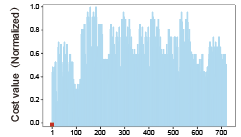
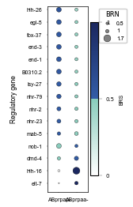

# Example of Caenorhabditis elegans dataset (Full)
***
In this tutorial, we utilized gene expression data and chromatin co-accessibility data, encompassing 244 regulatory genes and 339 target genes, along with the well-characterized C. elegans cell lineage, to infer gene regulatory networks. This example validates the performance of LineageGRN by successfully aligning the inferred target gene expression data with real target gene expression data. Furthermore, it demonstrates how to identify key regulatory genes driving cell fate bias.

!!! tip
    We analyzed two datasets derived from *C. elegans*. The first dataset (Core) is a smaller subset of the second dataset (Full). While the Core dataset allows for faster analysis, the Full dataset is essential for accurately inferring key regulatory genes driving cell fate bias and comprehensively evaluating the model's performance. Therefore, in this example, we used the Full dataset instead of the Core dataset to ensure robust and biologically meaningful results.


```python
import os
import numpy as np
import pandas as pd
from examples.data import *
from scipy.optimize import linear_sum_assignment

from lineagegrn.cell_lineage_reconstruction import *
from lineagegrn.gene_regulatory_network import *
from lineagegrn.plot.plot_analysis_results import *
from lineagegrn.downstream_analysis import *
```

## Time-scaled cell fate map retrieval

```python
map_df = pd.read_csv('examples/data/C.elegans/C.elegans_Full/additional_input_data/fate_map_topology.csv')
edges_dict_Celegans = {}
    
for top_key, group in map_df .groupby("Lineage"):
    sub_dict = {f"{row['Parent']}->{row['Child']}": row['Length'] for _, row in group.iterrows()}
    edges_dict_Celegans[top_key] = sub_dict
```

## Gene regulatory network inference
```python
## ABpr
edges_ABpr = parse_edge_dict(edges_dict_Celegans['ABpr'])
fate_map_ABpr= FateMap(edges_ABpr)
atac_file_path_ABpr = "examples/data/C.elegans/C.elegans_Full/input_data/ABpr/atac_data.csv"
expression_file_path_ABpr = "examples/data/C.elegans/C.elegans_Full/input_data/ABpr/expression_data.csv"

saved_dir_ABpr = 'examples/results/C.elegans/C.elegans_Full/ABpr'

grn_inference = GRNInference(atac_file_path_ABpr, expression_file_path_ABpr,fate_map_ABpr, saved_dir_ABpr)
grn_inference.estimate_all_target_genes(20)

ABpr_grn_dict=get_dynamic_networks(saved_dir_ABpr,fate_map_ABpr,0,regulatory_genes_name, target_genes_name)

## ABpl
edges_ABpl = parse_edge_dict(edges_dict_Celegans['ABpl'])
fate_map_ABpl= FateMap(edges_ABpl)
atac_file_path_ABpl = "examples/data/C.elegans/C.elegans_Full/input_data/ABpl/atac_data.csv"
expression_file_path_ABpl = "examples/data/C.elegans/C.elegans_Full/input_data/ABpl/expression_data.csv"

saved_dir_ABpl = 'examples/results/C.elegans/C.elegans_Full/ABpl'

grn_inference = GRNInference(atac_file_path_ABpl, expression_file_path_ABpl,fate_map_ABpl, saved_dir_ABpl)
grn_inference.estimate_all_target_genes(20)

ABpl_grn_dict=get_dynamic_networks(saved_dir_ABpl,fate_map_ABpl,0,regulatory_genes_name, target_genes_name)

## ABar
edges_ABar = parse_edge_dict(edges_dict_Celegans['ABar'])
fate_map_ABar= FateMap(edges_ABar)
atac_file_path_ABar = "examples/data/C.elegans/C.elegans_Full/input_data/ABar/atac_data.csv"
expression_file_path_ABar = "examples/data/C.elegans/C.elegans_Full/input_data/ABar/expression_data.csv"

saved_dir_ABar = 'examples/results/C.elegans/C.elegans_Full/ABar'

grn_inference = GRNInference(atac_file_path_ABar, expression_file_path_ABar,fate_map_ABar, saved_dir_ABar)
grn_inference.estimate_all_target_genes(20)

ABar_grn_dict=get_dynamic_networks(saved_dir_ABar,fate_map_ABar,0,regulatory_genes_name, target_genes_name)

## ABal
edges_ABal = parse_edge_dict(edges_dict_Celegans['ABal'])
fate_map_ABal= FateMap(edges_ABal)
atac_file_path_ABal = "examples/data/C.elegans/C.elegans_Full/input_data/ABal/atac_data.csv"
expression_file_path_ABal = "examples/data/C.elegans/C.elegans_Full/input_data/ABal/expression_data.csv"

saved_dir_ABal = 'examples/results/C.elegans/C.elegans_Full/ABal'

grn_inference = GRNInference(atac_file_path_ABal, expression_file_path_ABal,fate_map_ABal, saved_dir_ABal)
grn_inference.estimate_all_target_genes(20)

ABal_grn_dict=get_dynamic_networks(saved_dir_ABal,fate_map_ABal,0,regulatory_genes_name, target_genes_name)

ABprp_grn=np.array(ABpr_grn_dict['ABprp'])
ABprap_grn=np.array(ABpr_grn_dict['ABprap'])
ABara_grn=np.array(ABar_grn_dict['ABara'])
ABaraap_grn=np.array(ABar_grn_dict['ABaraap'])
ABplpa_grn=np.array(ABpl_grn_dict['ABplpa'])
ABalp_grn=np.array(ABal_grn_dict['ABalp'])
```


## Validation
1. **Input Measured Expression** : 
   - Input the measured target gene expression matrix for the ancestor nodes.
2. **Expression Prediction**: 
   - Predict the target gene expression matrix for the ancestor nodes using the GRN and the expression matrix of regulatory genes.
3. **High Expression Analysis**: 
   - For both the real and predicted target gene expression data, calculate the number of cells in which each target gene is highly expressed (based on a predefined threshold).
   - **Binarize Results**: Convert the results from Step 3 into two 0-1 vectors:
     - **1**: Indicates that the target gene is highly expressed in the majority of cells within the cluster represented by the node.
     - **0**: Indicates otherwise.
   - **Compute Distance**: 
     - Calculate the distance (e.g., Hamming distance) between the two vectors obtained in the step above.
4. **Matching**: 
   - Perform one-to-one matching using the Hungarian algorithm.


### Input Measured Expression

This step inputs the gene expression matrix of progenitor cell types.
```python
base_path = 'examples/data/C.elegans/C.elegans_Full/additional_input_data'

file_names = [
    'ABprp_count_matrix.csv',
    'ABprap_count_matrix.csv',
    'ABara_count_matrix.csv',
    'ABaraap_count_matrix.csv',
    'ABplpa_count_matrix.csv',
    'ABalp_count_matrix.csv',
    'ABala_count_matrix.csv',
    'ABplapp_count_matrix.csv',
    'ABplp_count_matrix.csv',
    'ABarp_count_matrix.csv',
    'ABarpa_count_matrix.csv',
    'ABprpa_count_matrix.csv'
]
count_matrices = {}

for file in file_names:
    key = os.path.splitext(file)[0]
    count_matrices[key] = pd.read_csv(os.path.join(base_path, file), index_col=0)
```

This step normalizes the expression matrix and split it into target gene expression matrix and regulatory gene expression matrix.
```python
ABprp_norm_count_matrix=normalize_to_zero_mean(count_matrices['ABprp_count_matrix'])
ABprp_tar=ABprp_norm_count_matrix.iloc[range(tar_num),:]
ABprp_reg=ABprp_norm_count_matrix.iloc[tar_num:,:]

ABprap_norm_count_matrix=normalize_to_zero_mean(count_matrices['ABprap_count_matrix'])
ABprap_tar=ABprap_norm_count_matrix.iloc[range(tar_num),:]
ABprap_reg=ABprap_norm_count_matrix.iloc[tar_num:,:]

ABara_norm_count_matrix=normalize_to_zero_mean(count_matrices['ABara_count_matrix'])
ABara_tar=ABara_norm_count_matrix.iloc[range(tar_num),:]
ABara_reg=ABara_norm_count_matrix.iloc[tar_num:,:]

ABaraap_norm_count_matrix=normalize_to_zero_mean(count_matrices['ABaraap_count_matrix'])
ABaraap_tar=ABaraap_norm_count_matrix.iloc[range(tar_num),:]
ABaraap_reg=ABaraap_norm_count_matrix.iloc[tar_num:,:]

ABplpa_norm_count_matrix=normalize_to_zero_mean(count_matrices['ABplpa_count_matrix'])
ABplpa_tar=ABplpa_norm_count_matrix.iloc[range(tar_num),:]
ABplpa_reg=ABplpa_norm_count_matrix.iloc[tar_num:,:]

ABalp_norm_count_matrix=normalize_to_zero_mean(count_matrices['ABalp_count_matrix'])
ABalp_tar=ABalp_norm_count_matrix.iloc[range(tar_num),:]
ABalp_reg=ABalp_norm_count_matrix.iloc[tar_num:,:]

```


### Expression Prediction
This step infers target gene expression levels of progenitor cell types using linear regression models.

```python
ABprp_inf_tar=pd.DataFrame(ABprp_grn@np.array(ABprp_reg))
ABprap_inf_tar=pd.DataFrame(ABprap_grn@np.array(ABprap_reg))
ABara_inf_tar=pd.DataFrame(ABara_grn@np.array(ABara_reg))
ABaraap_inf_tar=pd.DataFrame(ABaraap_grn@np.array(ABaraap_reg))
ABplpa_inf_tar=pd.DataFrame(ABplpa_grn@np.array(ABplpa_reg))
ABalp_inf_tar=pd.DataFrame(ABalp_grn@np.array(ABalp_reg))
ABprp_inf_tar.index=ABprap_inf_tar.index=ABara_inf_tar.index=ABaraap_inf_tar.index=ABplpa_inf_tar.index=ABalp_inf_tar.index=target_genes_name
```

### High Expression Analysis

```python
ABprp_high_expression_tar_infer=count_greater_than_threshold(ABprp_inf_tar,-count_matrices['ABprp_count_matrix'].values.mean())
ABprp_high_expression_tar=count_greater_than_threshold(ABprp_tar,-count_matrices['ABprp_count_matrix'].values.mean())

ABprap_high_expression_tar_infer=count_greater_than_threshold(ABprap_inf_tar,-count_matrices['ABprap_count_matrix'].values.mean())
ABprap_high_expression_tar=count_greater_than_threshold(ABprap_tar,-count_matrices['ABprap_count_matrix'].values.mean())

ABara_high_expression_tar_infer=count_greater_than_threshold(ABara_inf_tar,-count_matrices['ABara_count_matrix'].values.mean())
ABara_high_expression_tar=count_greater_than_threshold(ABara_tar,-count_matrices['ABara_count_matrix'].values.mean())

ABaraap_high_expression_tar_infer=count_greater_than_threshold(ABaraap_inf_tar,-count_matrices['ABaraap_count_matrix'].values.mean())
ABaraap_high_expression_tar=count_greater_than_threshold(ABaraap_tar,-count_matrices['ABaraap_count_matrix'].values.mean())


ABplpa_high_expression_tar_infer=count_greater_than_threshold(ABplpa_inf_tar,-count_matrices['ABplpa_count_matrix'].values.mean())
ABplpa_high_expression_tar=count_greater_than_threshold(ABplpa_tar,-count_matrices['ABplpa_count_matrix'].values.mean())


ABalp_high_expression_tar_infer=count_greater_than_threshold(ABalp_inf_tar,-count_matrices['ABalp_count_matrix'].values.mean())
ABalp_high_expression_tar=count_greater_than_threshold(ABalp_tar,-count_matrices['ABalp_count_matrix'].values.mean())
```


### Matching

```python
data_inf=[ABalp_high_expression_tar_infer,ABplpa_high_expression_tar_infer,ABaraap_high_expression_tar_infer,ABara_high_expression_tar_infer,ABprap_high_expression_tar_infer,ABprp_high_expression_tar_infer]
data_real=[ABalp_high_expression_tar,ABplpa_high_expression_tar,ABaraap_high_expression_tar,ABara_high_expression_tar,ABprap_high_expression_tar,ABprp_high_expression_tar]
Node_names=['ABalp','ABplpa','ABaraap','ABara','ABprap','ABprp']
match_ExpData(data_inf,data_real,Node_names)
```


```plaintext
Matching Result (Gene Expression Data (inferred) -> Gene Expression Data):
ABalp <-> ABalp
ABplpa <-> ABplpa
ABaraap <-> ABaraap
ABara <-> ABara
ABprap <-> ABprap
ABprp <-> ABprp
```

### Visualization



## Identifying key regulatory genes driving cell differentiation
This step identify the high expression target genes in each leaf nodes (sampled cell types).
```python
groups = {
    'ABar': {
        'names': ['ABarpp-', 'ABarap-', 'ABarpapp-', 'ABarpapa-', 'ABaraaa-', 'ABaraapp-', 'ABaraapaa-'],
        'extra_keys': ['ABarp','ABarpa','ABara','ABaraa','ABaraap','ABar']
    },
    'ABpr': {
        'names': ['ABprppa-','ABprpap-','ABprpaa-','ABpraa-','ABprappa-','ABprapa-'],
        'extra_keys': ['ABprp','ABprpa','ABprapp','ABpra','ABpr','ABprap']
    },
    'ABpl': {
        'names': ['ABplpppp-','ABplpap-','ABplpaa-','ABplapap-','ABplappp-','ABplappa-'],
        'extra_keys': ['ABplp','ABplpa','ABpla','ABplapp','ABpl']
    },
    'ABal': {
        'names': ['ABalpp-','ABalpa-','ABalap-','ABalaa-'],
        'extra_keys': ['ABalp','ABala','ABal']
    }
}

base_path = 'examples/data/C.elegans/C.elegans_Full/additional_input_data'
gene_expression_matrices = {}
high_expression_genes = {}

for group, info in groups.items():
    group_dict = {}
    for name in info['names']:
        file_path = f'{base_path}/{name}_count_matrix.csv'
        df = pd.read_csv(file_path, index_col=0)
        gene_expression_matrices[name] = df
        genes_var_name = name
        group_dict[genes_var_name] = [i for i in get_high_expression_genes(df) if i in target_genes_name]

    for key in info['extra_keys']:
        group_dict[key] = None
        
    high_expression_genes[group] = group_dict
```

Display partial key regulatory gene inference results.

```python
regulatory_gene_filter=list(pd.read_csv('examples/data/C.elegans/C.elegans_Core/additional_input_data/regulatory_genes_name.csv',index_col=0).iloc[:,0])
```
Take lineage *ABpr* as an example.

```python 
edges = parse_edge_dict(edges_dict_Celegans['ABpr'])
fate_map= FateMap(edges,high_expression_genes['ABpr'])
input_path='examples/results/C.elegans/C.elegans_Full/ABpr'
grn_dict_ABpr = get_dynamic_networks(input_path,fate_map,0.1, regulatory_genes_name, target_genes_name)
```

```python
ancestor_node_id='ABprpa'
child_nodes = [fate_map.nodes[ancestor_node_id].directed_edges[i].end for i in range(2)]
print(child_nodes)
high_expression_target_genes_in_child_1=fate_map.nodes[child_nodes[0]].high_expression_genes_in_leaf
high_expression_target_genes_in_child_2=fate_map.nodes[child_nodes[1]].high_expression_genes_in_leaf
 
Tar_1=list(set(target_genes_name) & set(high_expression_target_genes_in_child_1) - set(high_expression_target_genes_in_child_2))
Tar_2=list(set(target_genes_name) & set(high_expression_target_genes_in_child_2) - set(high_expression_target_genes_in_child_1))

key_regulators_df_ABprpa=find_fate_bias_genes(grn_dict_ABpr, 'ABprpa',Tar_1, Tar_2, regulatory_genes_name)

df=merge_key_regulators(key_regulators_df_ABprpa, child_nodes)
df_filter=filter_regulatory_genes(df,regulatory_gene_filter)
```

```plaintext
	Regulatory gene	PosRegStrBias_ABprpap-	RegBias_ABprpap-	PosRegStrBias_ABprpaa-	RegBias_ABprpaa-
5	pal-1	        0.472304	            0.000000	        0.527696	            0.600000
6	irx-1	        0.466638	            0.000000	        0.533362	            0.600000
9	eor-1	        0.457475	            0.000000	        0.542525	            0.600000
22	nhr-25	        0.456371	            0.000000	        0.543629	            0.500000
23	dpl-1	        0.468601	            0.000000	        0.531399	            0.600000
... ...
```


#### Visualization
```python
plot_fate_bias_genes(df_filter, child_nodes,output_path,figsize=(1.65,2.8))
```



